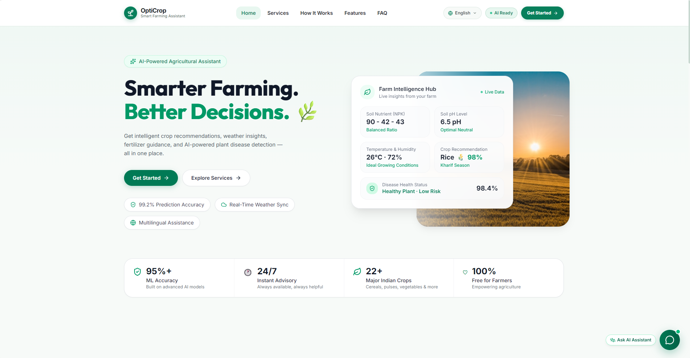
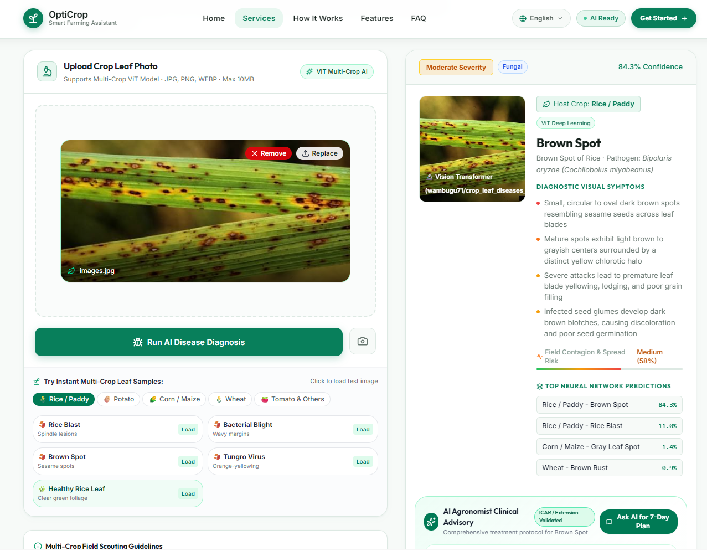
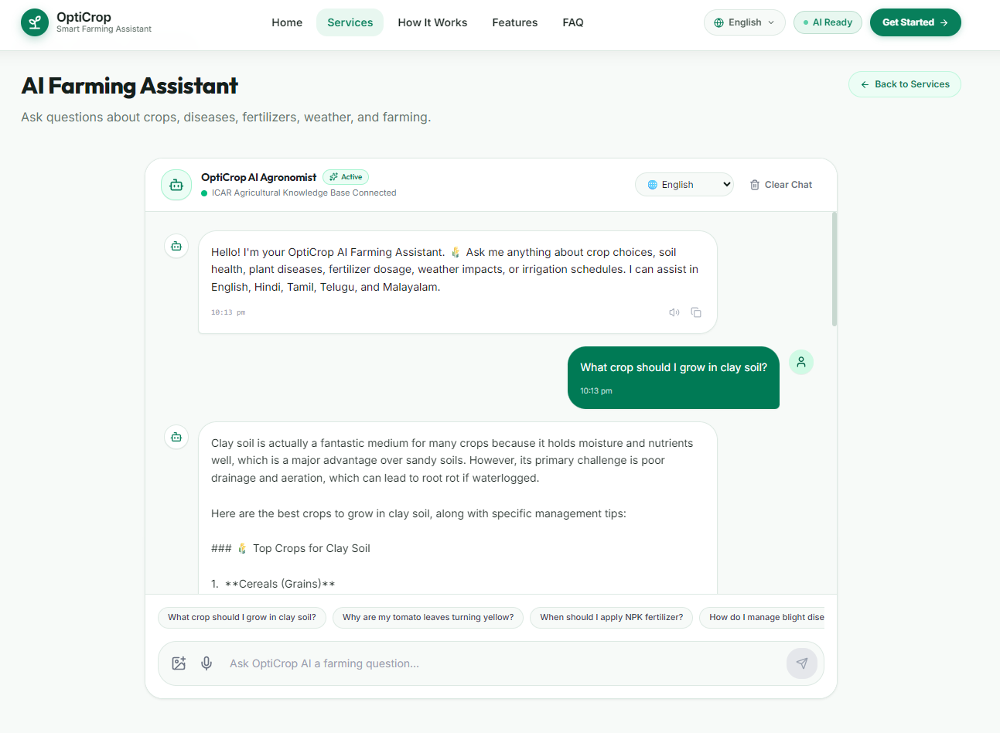

<h1 align="center">🌾 OptiCrop</h1>
<h3 align="center">Smart Agricultural Production Optimization Engine</h3>
<p align="center">🌱 Smarter Farming • Better Decisions • AI-Powered Agriculture</p>

<p align="center">
  <a href="https://opticrop-ochre.vercel.app">
    
  </a>
</p>

---

## 🌱 About OptiCrop

**OptiCrop** is an AI-powered agricultural decision-support platform designed to help farmers make smarter, more informed farming decisions.

The platform combines **Machine Learning, Computer Vision, Generative AI, Weather Intelligence, and agricultural data** to deliver practical recommendations for crop selection, plant disease identification, fertilizer guidance, and agricultural assistance.

> 🌾 *From agricultural data to intelligent farming decisions.*

---

## 🌐 Live Demo

<p align="center">🔗 <a href="https://opticrop-ochre.vercel.app">Live OptiCrop Website </a></p>

---

## 📸 Application Preview


<table>
<tr>
<td align="center" width="50%">
<b>🏠 Home Dashboard</b><br/><br/>

</td>
<td align="center" width="50%">
<b>🌱 Crop Recommendation</b><br/><br/>

</td>
</tr>
<tr>
<td align="center" width="50%">
<b>🍃 Disease Detection</b><br/><br/>

</td>
<td align="center" width="50%">
<b>🤖 AI Agricultural Assistant</b><br/><br/>

</td>
</tr>
<tr>
<td align="center" width="50%">
<b>🌦️ Fertilizer Recommendatiom</b><br/><br/>

</td>
<td align="center" width="50%">
<b>🌦️ Weather Intelligence</b><br/><br/>

</td>
</tr>
</table>

---

## ✨ Features

| Feature | Description |
|---|---|
| 🌱 **Crop Recommendation** | ML-powered crop recommendations based on soil and environmental parameters |
| 🍃 **Disease Detection** | CNN-based plant leaf disease classification using computer vision |
| 🤖 **AI Agricultural Assistant** | AI-powered agricultural chatbot with multilingual support |
| 🌦️ **Weather Intelligence** | Weather information used as additional agricultural context |
| 🧪 **Fertilizer Guidance** | Provides practical fertilizer-related recommendations |
| 📊 **Prediction Confidence** | Displays confidence information for ML predictions |
| 🌐 **Responsive Web Application** | Designed for desktop, tablet, and mobile screens |

---

## 🌱 Crop Recommendation

OptiCrop analyzes key agricultural parameters to recommend suitable crops.

**Input Parameters:** Nitrogen (N) • Phosphorus (P) • Potassium (K) • Temperature • Humidity • Soil pH • Rainfall • Season

```text
Agricultural Parameters
        ↓
   Data Validation
        ↓
  Data Preprocessing
        ↓
     ML Model
        ↓
  Crop Prediction
        ↓
Top Recommended Crops
        ↓
Confidence & Suitability
```

---

## 🍃 Plant Disease Detection

The disease detection module uses Computer Vision and CNN-based Deep Learning to analyze crop leaf images.

```text
Upload Leaf Image
        ↓
Image Preprocessing
        ↓
     CNN Model
        ↓
Disease Classification
        ↓
   Prediction Result
        ↓
Agricultural Information
```

---

## 🤖 AI Agricultural Assistant

OptiCrop includes an AI-powered agricultural assistant that answers farming-related questions.

**Supported Languages:** 🇬🇧 English • 🇮🇳 Tamil • 🇮🇳 Malayalam

The assistant provides conversational guidance on crops, plant diseases, fertilizers, weather, and farming practices.

---

## 🌦️ Weather Intelligence

OptiCrop integrates weather data to add environmental context to agricultural decisions — including temperature, humidity, rain conditions, current weather, and forecast information.

---

## 🧠 Artificial Intelligence Architecture

```text
                         ┌─────────────────────┐
                         │        FARMER        │
                         └───────────┬───────────┘
                                     │
                                     ▼
                    ┌────────────────────────────┐
                    │       OPTICROP WEB APP      │
                    │  React + TypeScript + Vite  │
                    │        Tailwind CSS         │
                    └──────────────┬─────────────┘
                                   │
                               REST API
                                   │
                                   ▼
                    ┌────────────────────────────┐
                    │       FASTAPI BACKEND       │
                    │           Python            │
                    └──────────────┬─────────────┘
                                   │
              ┌────────────────────┼────────────────────┐
              │                    │                     │
              ▼                    ▼                     ▼
     ┌────────────────┐   ┌────────────────┐   ┌────────────────┐
     │  Crop ML Model  │   │  Disease Model  │   │  AI Assistant  │
     │  scikit-learn   │   │   TensorFlow    │   │   OpenAI API   │
     └────────────────┘   └────────────────┘   └────────────────┘
              │                    │                     │
              └────────────────────┼────────────────────┘
                                   │
                                   ▼
                         ┌───────────────────┐
                         │    Weather API     │
                         └───────────────────┘
```

---

## 🏗️ System Architecture

| Component | Technology | Deployment |
|---|---|---|
| 🎨 Web Frontend | React 19 + Vite + TypeScript + Tailwind CSS | Vercel |
| ⚙️ Backend API | Python + FastAPI | Render |
| 🗄️ Database | PostgreSQL | Cloud |
| 🤖 Crop ML | scikit-learn | Backend |
| 🍃 Disease Detection | TensorFlow / Keras | Backend |
| 🧠 AI Assistant | OpenAI API | Backend Proxy |
| 🌦️ Weather | Weather API | Backend |
| 🔐 Authentication | JWT | Backend |

---

## 🛠️ Technology Stack

**🎨 Frontend**

<p>


</p>

**⚙️ Backend**

<p>


</p>

**🤖 AI / Machine Learning**

<p>


</p>

**🧰 Tools**

<p>


</p>

---

## 📁 Project Structure

```text
OptiCrop/
│
├── frontend/
│   ├── src/
│   │   ├── components/
│   │   ├── pages/
│   │   ├── api/
│   │   ├── hooks/
│   │   ├── types/
│   │   └── utils/
│   └── package.json
│
├── backend/
│   ├── app/
│   │   ├── api/
│   │   ├── models/
│   │   ├── schemas/
│   │   ├── services/
│   │   ├── core/
│   │   └── db/
│   ├── requirements.txt
│   └── .env.example
│
├── ml/
│   ├── notebooks/
│   ├── models/
│   └── datasets/
│
├── docs/
│   └── screenshots/
│       ├── home.png
│       ├── crop-recommendation.png
│       ├── disease-detection.png
│       ├── ai-assistant.png
│       └── weather.png
│
├── docker-compose.yml
└── README.md
```

---

## 🚀 Getting Started

### 📋 Prerequisites

- Node.js 20+
- Python 3.12+
- PostgreSQL 16+
- Git
- *(Optional)* Docker & Docker Compose

### 1️⃣ Clone Repository

```bash
git clone YOUR_GITHUB_REPOSITORY_URL
cd OptiCrop
```

### 2️⃣ Frontend Setup

```bash
cd frontend
npm install
npm run dev
```

App runs at: `http://localhost:5173`

### 3️⃣ Backend Setup

```bash
cd backend

# Create virtual environment
python -m venv venv

# Activate — Windows
venv\Scripts\activate
# Activate — macOS / Linux
source venv/bin/activate

# Install dependencies
pip install -r requirements.txt

# Set up environment file
cp .env.example .env

# Start backend
uvicorn app.main:app --reload
```

- Backend: `http://localhost:8000`
- Swagger API docs: `http://localhost:8000/docs`

### 4️⃣ Docker Setup (Optional)

```bash
docker-compose up -d
```

- Backend: `http://localhost:8000`
- PostgreSQL: `localhost:5432`

---

## 🔐 Environment Variables

**Backend** — create `backend/.env`:

```env
DATABASE_URL=your_postgresql_database_url
JWT_SECRET_KEY=your_secret_key
OPENAI_API_KEY=your_openai_api_key
WEATHER_API_KEY=your_weather_api_key
FRONTEND_URL=http://localhost:5173
ENVIRONMENT=development
MOCK_ML=false
```

**Frontend** — create `frontend/.env`:

```env
VITE_API_URL=http://localhost:8000
```

> ⚠️ Never commit `.env` files or API keys to GitHub.

---

## 🧪 Testing

**Backend**

```bash
cd backend
pytest tests/ -v
```

**Frontend**

```bash
cd frontend
npm run test
```

---

## 🧠 Machine Learning Workflow

```text
Agricultural Dataset
        ↓
   Data Cleaning
        ↓
   EDA Analysis
        ↓
Feature Selection
        ↓
Data Preprocessing
        ↓
  Model Training
        ↓
 Model Evaluation
        ↓
Model Serialization
        ↓
 FastAPI Backend
        ↓
 React Frontend
        ↓
     Farmer
```

### 📊 ML Model Components

**Crop Recommendation**
- `best_model.pkl`
- `standard_scaler.pkl`
- `label_encoder.pkl`
- `feature_names.pkl`
- `metadata.json`

**Disease Detection**
- `disease_model.keras`
- `disease_model.tflite`
- `class_names.json`
- `image_preprocessing.json`
- `metadata.json`
- `model_metrics.json`
- `disease_info.json`

> Model files may be excluded from the Git repository depending on their size and deployment requirements.

---

<p align="center">
🌾 <b>OptiCrop — Engineering Smarter Agriculture with AI.</b>
</p>
